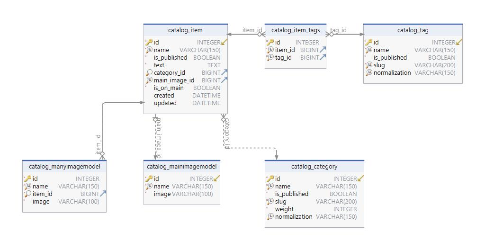

СТАТУС CI/CD

[](https://gitlab.crja72.ru/django_2023/students/225956-nperewerzew2005-course-967/badges/main/pipeline.svg)


Для запуска проекта Django (версии 4.2) в режиме разработки (dev-режиме), выполните следующие шаги:


1 - Убедитесь, что на вашем компьютере установлен Git и Python (если чего-то нет, то необходимо установить)


2 - Откройте cmd (коммандную строку / терминал)


3 - Перейдите в директорию, в котором будет находиться ваш проект


4 - Склонируйте проект с GitLab в данный репозиторий
```bash
git clone https://github.com/ваш-пользователь/ваш-репозиторий.git
```


5 - Находясь в каталоге проекта Django создайте вируальную среду python (необходимо установить модуль venv с помощью комманды pip) с помощью комманды 
```bash
python -m venv venv
```
    

6 - Активируйте виртуальную среду 

В Windows:
```bash
venv/Scripts/activate
```

В macOS и Linux:
```bash
source venv/bin/activate
```

После прописания комманды убедитесь, что виртуальная среда активирована "(venv)"


7 - Переходим в директорию с папкой requirements и прописываем сделующие комманды
```bash
pip install -r requirements/prod.txt
pip install -r requirements/dev.txt
pip install -r requirements/test.txt
```

8 - Измените в файле template.env значение YOUR_DJANGO_KEY на ваш секретный ключ (какой вам угодно)
Измените в файле template.env значение ALLOWED_HOSTS (если есть необходимость), или оставьте без изменений
Измените в файле template.env значение DEBUG на 'true', 'yes', '1', 'y', 't' (одно из), если хотите включить отладку, или на что-то другое в обратном случае
Измените в файле template.env значение DJANGO_MAIL (почта, с которой будут отправляться письма пользователям)
Измените в файле template.env значение DEFAULT_USER_IS_ACTIVE (активирован ли пользователь по умолчанию `true` - да, `false` - нет)


9 - Каждый 10 ответ будет содержать перевернутые русский слова, чтобы это отключить в файле template.env измените значение DJANGO_ALLOW_REVERSE на false (буквы могут быть в произвольном регистре)

10 - Языки

Если вам нужно добавить свой язык перевода сайта, то вам необходимо в файле
```bash
lyceum/lyceum/settings.py
```

Добавить в `LANGUAGES` необходимый вам язык, пример:
```bash
LANGUAGES = [
("en", _("English")),
("ru", _("Русский")),
("custom", _("Custom Language")),
...,
]
```

Для переключения между языками используйте параметр `LANGUAGE_CODE` (находится чуть выше `LANGUAGES`), там вы используете сокращенное название языка ("en", "ru", "custom", ...)

После добавления нового языка в LANGUAGES, выполните следующие команды в консоли:
```bash
django-admin makemessages -l <custom>
```

Перейдите в каталог с файлом перевода и откройте его
```bash
locale/<custom>/LC_MESSAGES/django.po
```
В файле отредактируйте все файлы с переводом текста (msgstr), пример:
```bash
msgid "Clash Roale"  // оригинал
msgstr "Clsh Rl"  // перевод
```

После необходимо сохранить изменения, написав в коммандную строку следующую комманду:
```bash
django-admin compilemessages
```

Поздравляем, теперь вы можете переключиться на созданный вами перевод!


11 - Запускаем сервер разработки, прописывая следующую комманду
```bash
python manage.py runserver
```


12 - Проверяем роботоспособность сервера, переходим по адрессу http://127.0.0.1:8000/ (или localhost), где вы увидите страницу с приветсвием от Django


Для остановки сервера разработки нажмите Ctrl+C в командной строке.


Ниже вы можете видеть схему БД


